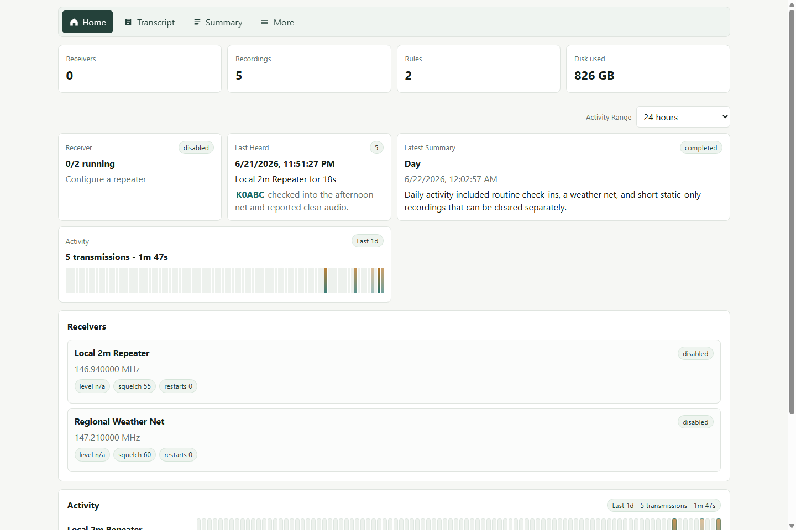
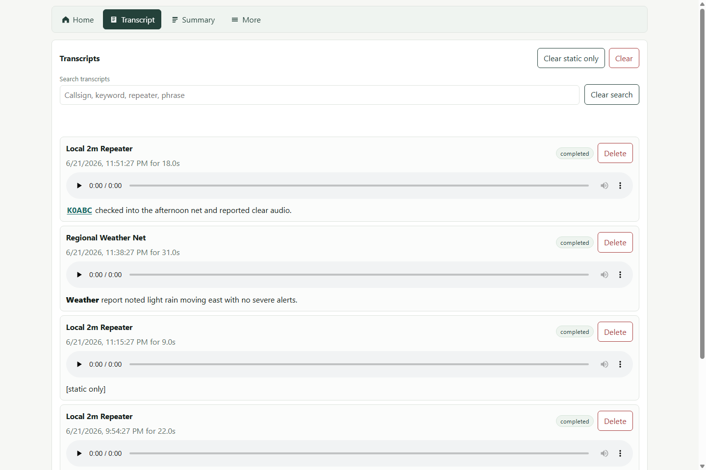
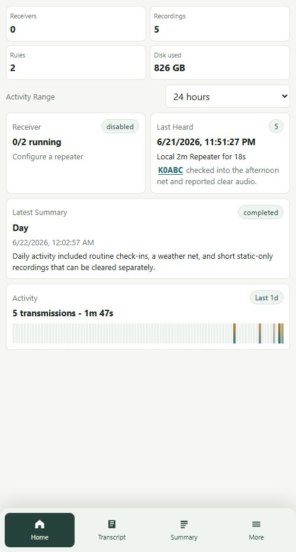
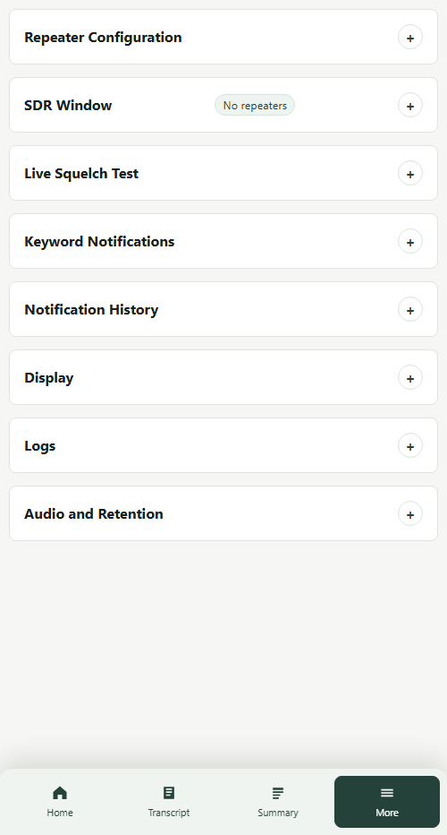

# RepeaterWatch

RepeaterWatch is a local-first Raspberry Pi web app for monitoring analog FM repeaters with an RTL-SDR dongle. It records active transmissions, keeps searchable transcripts, generates rolling summaries, and can send Web Push notifications for configured traffic.

The application is FastAPI, SQLite, and static PWA assets. There is no Node build step.

## Screenshots

These screenshots are captured from the running app with sanitized sample data.

Desktop browser home page:



Desktop browser transcript page:



Phone-width home page:



Phone-width More page:



## Functions

- Monitors one analog FM repeater with `rtl_fm`, or multiple nearby repeaters from one shared RTL-SDR IQ stream.
- Records active transmissions as WAV files with metadata.
- Keeps repeater courtesy tones and short pauses attached to the same recording instead of creating beep-only clips.
- Transcribes recordings with `noop`, local `faster-whisper`, or an OpenAI-compatible transcription API.
- Normalizes common ham-radio callsign speech such as "kilo zero xray yankee zulu" into `K0XYZ`.
- Generates scheduled summaries for 15-minute, hourly, and daily windows.
- Adds an Activity Chat page for asking a configured model about recent transcripts and saved summaries.
- Shows transcripts and summaries as searchable timelines.
- Sends standards-based Web Push notifications for keyword rules and non-automated traffic.
- Runs as a local PWA on desktop or mobile, including iOS Home Screen web apps.

## Data Flow

RepeaterWatch listens to receiver audio, segments speech with a conservative VOX pipeline, stores recordings and metadata, then runs optional transcription, summary, and notification workers in the background.

When one repeater is enabled, it uses the `rtl_fm` receiver path. When multiple repeaters are enabled and `[sdr].multi_repeater_enabled = true`, it starts one `rtl_sdr` IQ source and channelizes each configured repeater in software. If the enabled repeaters do not fit inside the usable SDR passband, the receiver does not start and the UI shows the suggested center frequency and required sample rate.

## Project Status

This project was built primarily with AI-generated code. It has automated tests and has been exercised on a local Raspberry Pi deployment, but it should still be reviewed carefully before relying on it for unattended or production use.

## Hardware And Software

Hardware:

- Raspberry Pi 4 or newer.
- RTL-SDR compatible dongle, such as an RTL-SDR Blog V4.
- Antenna appropriate for the repeater band.
- Optional powered USB hub if the SDR is unstable.

System packages:

- `rtl-sdr`
- `sox`
- `ffmpeg`
- Python 3.11 or newer with `venv`
- `git`

## Quick Start On Raspberry Pi OS

Install system packages and create a service user:

```bash
sudo apt update
sudo apt install -y rtl-sdr sox ffmpeg python3 python3-venv git
id -u repeaterwatch >/dev/null 2>&1 || sudo useradd --system --create-home --groups plugdev repeaterwatch
sudo mkdir -p /etc/repeaterwatch
```

Clone and install RepeaterWatch:

```bash
sudo git clone https://github.com/noahwilde/repeaterwatch.git /opt/repeaterwatch
cd /opt/repeaterwatch
sudo chown -R repeaterwatch:repeaterwatch /opt/repeaterwatch /etc/repeaterwatch
sudo -u repeaterwatch python3 -m venv .venv
sudo -u repeaterwatch .venv/bin/pip install --upgrade pip
sudo -u repeaterwatch .venv/bin/pip install -e '.[transcribe]'
sudo -u repeaterwatch .venv/bin/repeaterwatch --config /etc/repeaterwatch/config.toml init-config
```

Edit `/etc/repeaterwatch/config.toml` and add at least one repeater. Then run the app:

```bash
sudo -u repeaterwatch .venv/bin/repeaterwatch --config /etc/repeaterwatch/config.toml serve
```

Open:

```text
http://<pi-hostname-or-ip>:8078
```

## Configuration

The included `config.example.toml` is a safe starting point. A normal Pi install keeps runtime configuration in `/etc/repeaterwatch/config.toml`.

With the default `[storage] data_dir = "data"`, data is stored relative to the config file. For the Pi layout above, recordings and the SQLite database live under:

```text
/etc/repeaterwatch/data
```

That keeps captured audio, transcripts, summaries, and local settings separate from the application code in `/opt/repeaterwatch`.

API-backed transcription and summaries use environment variable names from the config, not key values:

```toml
[transcription]
backend = "openai-compatible"
remote_base_url = "https://api.openai.com/v1"
remote_api_key_env = "OPENAI_API_KEY"
remote_model = "gpt-4o-transcribe"
remote_min_duration_seconds = 2.0

[summary]
backend = "openai-compatible"
base_url = "https://api.openai.com/v1"
api_key_env = "OPENAI_API_KEY"
model = "gpt-4.1-mini"
scheduled_windows = ["hour", "day"]
per_repeater_scheduled = false
skip_automated_only = true
schedule_delay_seconds = 120.0

[activity_chat]
backend = "openai-compatible"
base_url = "https://api.openai.com/v1"
api_key_env = "OPENAI_API_KEY"
model = "gpt-5.4-nano"
default_hours = 24
```

For local-only operation, leave remote AI backends as `noop` or use `faster-whisper` for transcription and Ollama for summaries or activity chat.
Activity Chat is manual and stateless: the browser sends the current chat thread plus the selected recent time range, and the server prompts the model to answer only from transcripts and saved summaries that were actually recorded.

## Minimizing API Usage

OpenAI-compatible transcription and summary backends are optional. To reduce unnecessary API calls:

- Leave `[transcription].backend` and `[summary].backend` as `noop` until you are ready to use remote AI.
- Prefer local `faster-whisper` transcription and Ollama summaries when the Pi can handle the workload.
- Keep `[transcription].remote_min_duration_seconds` at `2.0` or higher so very short static bursts and courtesy tones are marked `[static only]` without a remote transcription call.
- Use `[summary].scheduled_windows = ["hour", "day"]` to avoid automatic 15-minute summaries. Add `"quarter_hour"` only if you want them.
- Keep `[summary].per_repeater_scheduled = false` unless you need separate scheduled summaries for every repeater. Manual per-repeater summaries still work from the Summary tab.
- Keep `[summary].skip_automated_only = true` so windows containing only repeater IDs, welcome messages, and tone announcements do not call the summary model.
- Raise `[summary].min_transcripts` to `2` or `3` if one isolated transmission is not worth summarizing automatically.
- Leave `[activity_chat].backend = "noop"` unless you want manual chat turns to call a model. Use a cheaper conversational model such as `gpt-5.4-nano` for this path.

These same controls are available in the More tab under API Usage. That panel also tracks remote transcription, summary, and activity chat calls over time, including skipped guardrail events, errors, returned token counts when available, and audio seconds sent for transcription.

## Web Push Notifications

Web Push requires VAPID keys. Generate them once:

```bash
sudo -u repeaterwatch /opt/repeaterwatch/.venv/bin/repeaterwatch generate-vapid
```

Paste the printed `[notifications]` values into `/etc/repeaterwatch/config.toml`. The private key can also be supplied with `REPEATERWATCH_VAPID_PRIVATE_KEY`.

iOS/iPadOS Web Push requires all of these:

- iOS/iPadOS 16.4 or newer.
- An HTTPS URL with a trusted certificate.
- A Home Screen web app. Open the HTTPS URL in Safari, use Share > Add to Home Screen, then reopen RepeaterWatch from the Home Screen icon before enabling notifications.

The permission request is only made after the user presses the enable button.

References:

- [Apple: Sending web push notifications in web apps and browsers](https://developer.apple.com/documentation/usernotifications/sending-web-push-notifications-in-web-apps-and-browsers)
- [WebKit: Web Push for Web Apps on iOS and iPadOS](https://webkit.org/blog/13878/web-push-for-web-apps-on-ios-and-ipados/)

## HTTPS

Plain LAN HTTP is not a secure context for iOS Web Push. To serve RepeaterWatch directly over HTTPS, configure the server with a certificate and private key:

```toml
[server]
host = "0.0.0.0"
port = 8443
ssl_certfile = "/etc/repeaterwatch/tls/server.crt"
ssl_keyfile = "/etc/repeaterwatch/tls/server.key"
```

For a LAN-only install, generate a local CA and a server certificate with subject alternative names for the Pi IP address and hostname. Install and fully trust the local CA certificate on each iPhone/iPad before opening:

```text
https://<pi-hostname-or-ip>:8443
```

You can also run RepeaterWatch behind Caddy; adapt `deploy/Caddyfile.example` for your hostname.

## Run With systemd

```bash
sudo cp /opt/repeaterwatch/deploy/repeaterwatch.service /etc/systemd/system/repeaterwatch.service
sudo systemctl daemon-reload
sudo systemctl enable --now repeaterwatch
sudo journalctl -u repeaterwatch -f
```

The default service runs as user `repeaterwatch`, uses `/etc/repeaterwatch/config.toml`, and serves on `0.0.0.0:8078`.

## RTL-SDR Setup

If the dongle is claimed by the DVB driver, blacklist it:

```bash
echo 'blacklist dvb_usb_rtl28xxu' | sudo tee /etc/modprobe.d/blacklist-rtl-sdr.conf
sudo reboot
```

For USB permissions, install the rtl-sdr udev rules from your distro package or copy the upstream rules for your dongle, then reload udev:

```bash
sudo udevadm control --reload-rules
sudo udevadm trigger
```

Test the receiver path:

```bash
sudo -u repeaterwatch /opt/repeaterwatch/.venv/bin/repeaterwatch \
  --config /etc/repeaterwatch/config.toml \
  test-sdr \
  --frequency 146.940M
```

Live listen while tuning squelch:

```bash
sudo -u repeaterwatch /opt/repeaterwatch/.venv/bin/repeaterwatch \
  --config /etc/repeaterwatch/config.toml \
  listen-sdr \
  --frequency 146.745M \
  --gain 20 \
  --squelch 0
```

Use `--squelch 0` to hear the raw noise floor first, then raise squelch until idle noise stops. Try `--squelch 40`, `60`, `80`, and `100`. If squelch has to be very high, try lower fixed gain values such as `--gain 10` or `--gain 20` instead of `auto`.

The web UI also includes a live squelch test under More. Normal RepeaterWatch receivers are paused while the live web test is active, then resumed when it stops.

## Multi-Repeater Monitoring

Recommended defaults:

```toml
[sdr]
multi_repeater_enabled = true
sample_rate = 2400000
guard_band_khz = 100
edge_warning_khz = 50
# Optional fixed center. When omitted, RepeaterWatch uses the midpoint of enabled repeaters.
# center_frequency_mhz = 146.8725
```

The usable passband is:

```text
sample_rate - (2 * guard_band)
```

With the default `2400000` Hz sample rate and `100` kHz guard band, the usable bandwidth is about `2.2` MHz. Disabled repeaters do not affect the center-frequency calculation or validation.

New repeater config files may use either legacy or descriptive field names:

```toml
[[repeaters]]
name = "Local 2m Repeater"
frequency_mhz = 146.745
tone = "100.0"
enabled = true

[[repeaters]]
name = "Regional Weather Net"
receive_frequency = 147.210
location = "Example Region"
coverage_area = "Regional"
repeater_type = "weather"
enabled = true
```

The SDR window panel under More shows the current center frequency, sample rate, usable edges, and repeater markers:

- Green: inside the usable passband.
- Yellow: near the guard-band edge.
- Red: outside the usable passband.
- Gray: disabled.

If a repeater is outside the current window, either disable it, increase `[sdr].sample_rate` within RTL-SDR limits, or set a different `[sdr].center_frequency_mhz`. RepeaterWatch suggests the midpoint center frequency but does not rewrite it automatically.

Known limitations:

- The shared receiver uses a lightweight NumPy NBFM channelizer intended for Raspberry Pi-class hardware. Start with a few nearby repeaters and watch CPU/load.
- Very weak signals near the passband edge may need a higher sample rate, lower guard band only if RF conditions allow, or a better antenna/filter.
- One RTL-SDR cannot monitor frequencies that exceed its usable instantaneous bandwidth.

## Recording Segmentation

RepeaterWatch keeps a recording open until VOX sees `post_silence_seconds` of quiet audio. The default is `6.0` seconds, so short pauses, repeater courtesy tones, and squelch tails stay attached to the preceding transmission instead of creating separate beep-only recordings.

## Transcription And Summaries

Default transcription mode is `noop`, which preserves the workflow without running speech-to-text. For local transcription:

```toml
[transcription]
backend = "faster-whisper"
model = "base"
compute_type = "int8"
```

Larger Whisper models improve accuracy but are slower on Raspberry Pi hardware. Ham callsigns may still be misrecognized; RepeaterWatch stores the original transcript and supports corrections from the API/UI path.

Default summary mode is `noop`, which creates a local extractive summary and never invents callsigns. For Ollama:

```toml
[summary]
backend = "ollama"
base_url = "http://localhost:11434"
model = "llama3.1"
```

For LM Studio summaries, prefer the native backend. It uses LM Studio's `/api/v1/chat` endpoint, can turn reasoning off, and avoids spending local GPU time on hidden reasoning tokens. If RepeaterWatch is running on a Raspberry Pi and LM Studio is on another computer, use that computer's LAN IP address instead of `localhost`:

```toml
[summary]
backend = "lm-studio"
base_url = "http://192.168.1.12:1234"
model = "daily-gemma-12b-64k"
reasoning = "off"
max_prompt_chars = 0
```

Set `max_prompt_chars = 0` to avoid app-side truncation. The selected model still needs enough context for the full prompt.

For activity chat, or for another OpenAI-compatible local text server, use the OpenAI-compatible backend with the server's `/v1` URL:

```toml
[summary]
backend = "openai-compatible"
base_url = "http://192.168.1.12:1234/v1"
model = "gemma-3-1b-it"

[activity_chat]
backend = "openai-compatible"
base_url = "http://192.168.1.12:1234/v1"
model = "gemma-3-1b-it"
```

OpenAI-compatible local/private LAN URLs do not require an API key. Public OpenAI-compatible providers still require the configured API key environment variable.

AI summaries receive trusted receiver context for each transcript, including repeater name, frequency, tone, optional location, coverage area, type, and notes. Combined summaries preserve the source repeater metadata for each transcript and should not merge unrelated traffic unless the transcripts clearly support correlation.

LM Studio is a text-generation server; it does not provide RepeaterWatch's multipart `/audio/transcriptions` workflow in normal LM Studio server mode. For local transcription, use `faster-whisper`, or point `[transcription].remote_base_url` at a separate OpenAI-compatible speech-to-text service that supports `/audio/transcriptions`.

## CLI Reference

The examples use the global `--config` option before the subcommand:

```bash
repeaterwatch --config config.toml serve
repeaterwatch --config config.toml init-config
repeaterwatch generate-vapid
repeaterwatch --config config.toml test-sdr --frequency 146.940M
repeaterwatch --config config.toml listen-sdr --frequency 146.745M --squelch 0
repeaterwatch --config config.toml transcribe-pending
repeaterwatch --config config.toml summarize-now --window last_hour
repeaterwatch --config config.toml cleanup --days 30
```

## Updating An Existing Pi Install

This layout keeps your app code in `/opt/repeaterwatch` and your runtime config/data in `/etc/repeaterwatch`. Updating the app should only touch the code checkout and virtual environment:

```bash
cd /opt/repeaterwatch
sudo git pull --ff-only
sudo systemctl stop repeaterwatch
sudo chown -R repeaterwatch:repeaterwatch /opt/repeaterwatch
sudo -u repeaterwatch .venv/bin/pip install -e '.[transcribe]'
sudo systemctl start repeaterwatch
sudo journalctl -u repeaterwatch -f
```

If you previously stored data under `/opt/repeaterwatch/data`, move it to a dedicated runtime directory or keep a backup before replacing the code checkout.

## Development

```bash
python -m venv .venv
.venv\Scripts\pip install -e ".[dev]"
.venv\Scripts\python -m pytest
```

On Linux/macOS:

```bash
python3 -m venv .venv
. .venv/bin/activate
pip install -e ".[dev]"
pytest
```

## Safety And Legal Notice

You are responsible for complying with local laws, radio regulations, license terms, and privacy rules. RepeaterWatch is intended only for transmissions you are legally allowed to receive and store.
